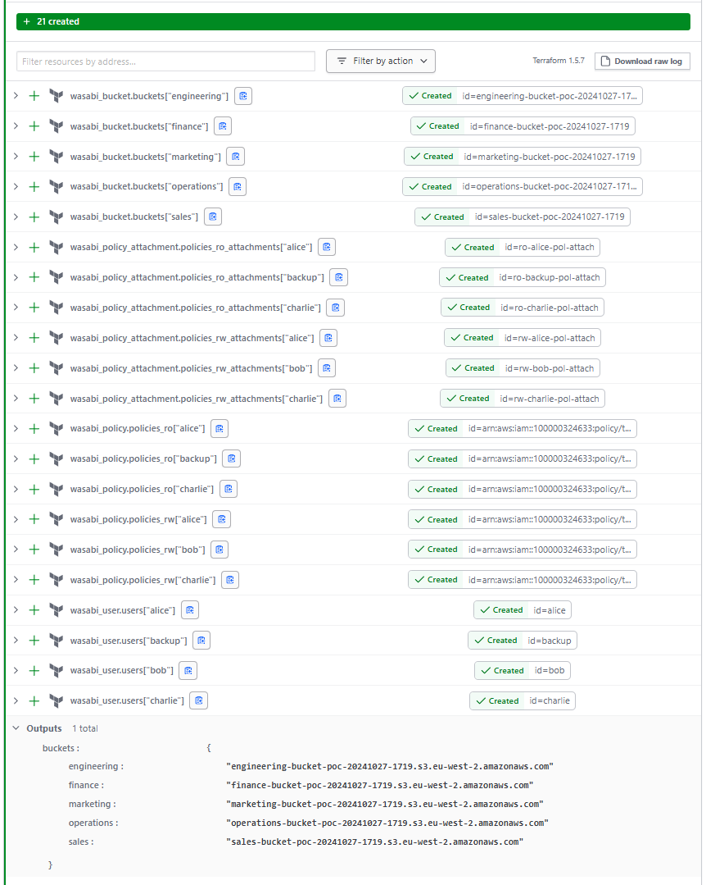

# wasabi_experiments

- Implementation of creating [Wasabi](https://wasabisys.com/) buckets for several departments and granting access to them to some users according to the permission matrix (see the `terraform.tfvars` file).
- Implemented for [Terraform Cloud](https://app.terraform.io/). To run locally, you need to switch to the local backend (see the `backend.tf` file) and provide valid credentials to connect to the Wasabi account.

### The results
